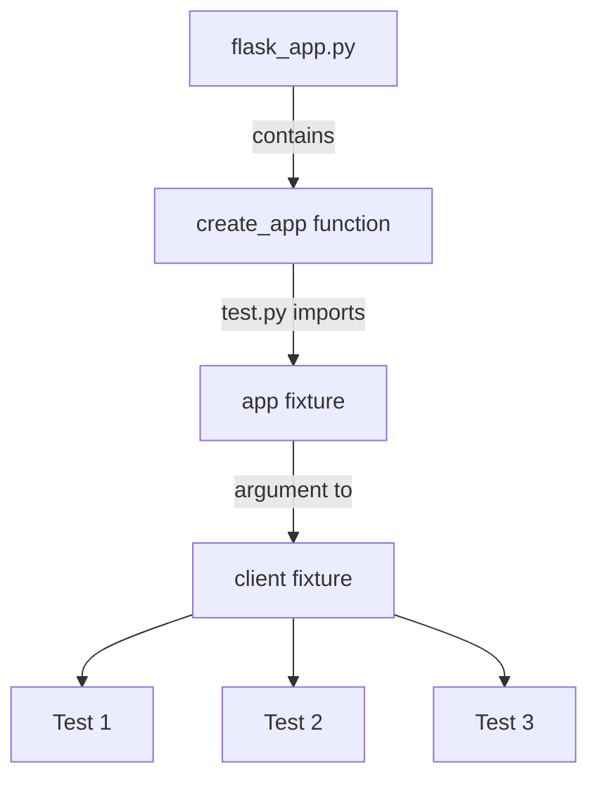
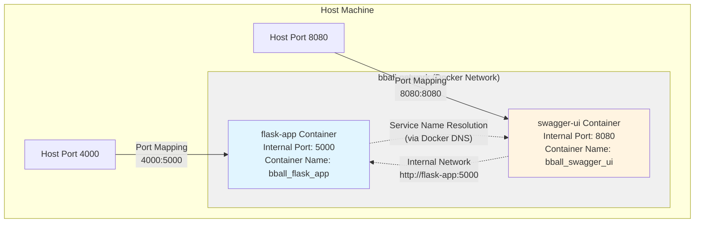

<!---
title: "Testing Part II & Docker Compose"
--->

# Pytest

- We will continue our discussion of testing by going into the details of how to implement testing inside our system. There are a number of things that we will need to do to get this complete, each will be highlighted below.
  - file structure 
  - `makefile` update
  - `test/test.py` file

## Added Requirements

- We will need to add three packages to get our testing to work: `pytest`, `pytest-cov`, and `pytest-order`.
- `pytest` is the core testing framework.
- `pytest-cov` handles the coverage calculations that we are interested in seeing.
- `pytest-order` allows us to control the execution order of tests (needed for sequential tests).
- As per usual, to get these I went into `interactive` mode and ran `uv add <package-name>` to add each package.

```
pytest==8.3.4
pytest-cov==6.0.0
pytest-order==1.2.1
```

## File structure

- When running tests we generally put the test code outside of the main directory of the source code. 
- For big projects this makes lots of sense, there is already so much code in the repo that breaking it apart at a higher abstraction / file system level will make our code a lot easier to read.
- A common framework for how to organize files for testing is a mirror strategy, such as the below:

```
.
├── app/
│   ├── routes/
│   │   └── stock_routes.py
│   └── helpers/
│   │   └── decorators.py
│   └── ...
└── test/
    ├── routes/
    │   └── test_stock_routes.py
    └── helpers/
    │   └── test_decorators.py    
    └── ... 
```

Using a mirror strategy like this works well for unit tests because they align with the code. 

- Unfortunately this does not work as well with integration and E2E tests as those tests tend to cross the lines defined by the file.
- In these case we will just create a separate directory under `test` to handle these specific tests:

```
└── test/
    ├── e2e/
    │   └── test_e2e.py
    ├── routes/
    │   └── test_stock_routes.py
    └── helpers/
    │   └── test_decorators.py    
    └── ... 
```

Depending on the volume of the tests this can be an effective strategy, however I have seen others as test scope expands.

- Given the simpler nature of what we are doing here (and the small number of tests) we will add only a `test` directory and a `test.py` file inside that directory:

```
|── app/
└── test/
    └── test.py
```


## Our Makefile command

- The command that we use to run `pytest` in our `makefile` is a bit complex. In this section we will analyze what each piece of this command does. Note that this does require `pytest-cov` to be installed to handle the coverage reporting.

- Currently the command [in our makefile](../lecture_examples/15_testing/Makefile) looks like this:

```
uv run pytest --cov=app /app/src/test/test.py --cov-report=term-missing -v
```

- Below you can find a description of each component and what it is used for.

| Component | Description | 
| --- | --- | 
| `pytest` |  The base command to run Python tests | 
| `--cov=app` | <ul><li>This flag enables coverage reporting through the pytest-cov plugin</li><li>The `app` part specifies the package/directory to measure code coverage for</li><li>It will track which lines of code in the `app` directory are executed during tests</li></ul> | 
| `/app/src/test/test.py` | <ul><li>The path to the test file(s) to run</li><li>In this case, it's running tests from a specific file named `test.py`</li><li>The path indicates it's located at `/app/src/test/test.py`</li></ul> | 
| `--cov-report=term-missing` | <ul><li>This configures the coverage report format</li><li>`term-missing` generates a terminal report that shows:</li><li>Coverage percentage for each file</li><li>Line numbers of code that wasn't executed during tests (missing coverage)</li><li>This helps identify which specific lines need additional test coverage</li></ul> |
| `-v` | <ul><li>Enables verbose output</li><li>Shows more detailed test execution information</li><li>Displays the name of each test as it runs</li><li>Shows additional details about test passes/failures</li></ul> |

When run, this command will:
1. Execute all tests in test.py
2. Track which lines of code in the `app` directory are run
3. Display detailed test results in the terminal
4. Show a coverage report with missing lines
5. Provide verbose output of the test execution

- You should verify that the options do what they are expected -- if you run without `-v` what does the output look like? What about the other options?


## pytest file

- There are a number of features that we want to call out in our `test/test.py` file. We will reproduce the file [here](../lecture_examples/15_testing/test/test.py).

```python
import sys
from pathlib import Path

import pytest
from jsonschema import validate

from flask_app import create_app  # noqa E402


@pytest.fixture
def app():
    """Create and configure a test instance of the application."""
    app = create_app()
    app.config.update({
        "TESTING": True,
        # Add any test-specific configuration here
    })
    return app


@pytest.fixture
def client(app):
    """Create a test client for the app."""
    return app.test_client()


def test_app_exists(app):
    """Test that the app exists."""
    assert app is not None


def test_app_is_testing(app):
    """Test that the app is in testing mode."""
    assert app.config["TESTING"]


def test_player_response(client):
    """Test the /api/players endpoint."""
    HTTP_OK = 200

    schema = {
        "type": "object",
        "properties": {
            "players": {
                "type": "array",
                "items": {
                    "type": "object",
                    "properties": {
                        "id": {"type": "number"},
                        "player_name": {"type": "string"}
                    },
                    "required": ["id", "player_name"]
                }
            }
        },
        "required": ["players"]
    }
    response = client.get("/api/players")
    # Assert response is JSON
    assert response.status_code == HTTP_OK
    assert response.content_type == "application/json"

    # Assert we can parse the response as JSON
    json_data = response.get_json()
    validate(instance=json_data, schema=schema)
```


### Imports: app.py vs. flask_app.py

- The first section of the code is a bit complex but sets up the proper imports and import structure.
- As a starting note, in our code base we have renamed `app.py` to `flask_app.py`. Why did we do this?
  - We needed to do this because there is a directory `app` at the same level as `app.py` which makes it difficult to import structures from.
  - If we tried to import form `app` at this level python would not know which to import from -- the directory `app` or the file `app.py`
  - To avoid this we rename `app.py` to `flask_app.py`
- Reading over the first few lines we can see that we end with importing the `create_app` function from the original `app.py` now renamed `flask_app.py`.

### Fixtures & Test Client

- The next section of the code is are two decorated functions: `client` and `app`.
- These two functions are decorated with `@pytest.fixtures`. 
- Fixtures are a special decorator which creates reusable components across tests.
  - These components can be anything: functions, data, other objects.
- Fixtures are required because tests often require specific assets which we want to reuse and tests are (by design) built in an isolated manner. We want our tests to run independently so that the result of one test does not effect the result of another.
- That same silo effect means that when we want to reuse something (such as run multiple tests against the same flask app) we need to use special language to define these objects as such.
- There are multiple reasons why we want reusability:
  - In our case, starting the flask app takes time and because we know the flask app has no state to worry about we can just start it once and then pass it around.
  - Mocking up a specific dataset is annoying and being able to reuse it over and over allows us to avoid wasting developer time.
- Looking over the code you can see that once the functions (`client` and `app`) are defined as fixtures we can pass them into the rest of the test functions. 
- You can see the flow in the diagram below.



- A final note on this -- when you look at the `client` fixture you'll see that it returns a client of the form `test_client`.
- This `test_client` is a simplified version of the flask server designed for testing. You can find more information about how it works [here](https://flask.palletsprojects.com/en/stable/testing/).

### Tests functions

- Once the client is created we can then set up test _functions_.
- A test function always begins with the name `test_`. Pytest uses this to find tests in the file. If you name it something else you may need to reconfigure `pytest` to be able to find the file.
- There are three test functions in the above file:

1. `test_app_exists` 
2. `test_app_is_testing`
3. `test_player_response`


- The first one verifies that the `app` fixture exists. This is a good check to make sure that the flask test app is working properly. 
- The second one verifies that the config property that we set on the app fixture is set to testing. Once again, this is just verifying that we are seeing what we should expect before launching into the more functional tests.
- The third test function `test_player_response` contains _three_ specific tests:
    1. Verify the status code using an assert on `response.status_code`
    2. Verify the content returned is what we expect using `response.content_type`
    3. Use the `validate` function to verify that the schema that the data returned by the response matches the schema specified.
   
- Importantly we want to make a difference between test _functions_ which can encapsulate multiple tests. Most test functions that we write will have multiple tests inside of them to verify the specific behavior.

- Looking closely at the last test function we can see that it accepts a _client_ as an argument. This client is _not_ defined in the "standard" manner in the python file, it is instead defined using the `fixture`.

### Exact Tests vs. Schema Tests

- In the homework assignment you will be asked to write both schema tests and _exact_ tests. An exact test, for the purpose of this class is one that validates the specific numbers that are returned by the application.
- Consider the following test, which is is in `test.py`. We will discuss it a bit below.

```python
def test_WAS_colleges_exact_response(client):
    expected_response = {
        "colleges": [
            "Texas A&M",
            "Iowa State",
            "Winthrop",
            "Southern California",
            "Kansas",
            "None",
            "Utah",
            "Arkansas",
            "Virginia",
            "Florida",
            "Gonzaga",
            "Oakland",
            "San Francisco",
            "St. Louis",
            "San Diego State",
            "Wisconsin"
        ]
    }

    response = client.get('/api/colleges/WAS/list')
    assert response.status_code == 200
    assert response.content_type == 'application/json'

    # Get the actual response data
    actual_response = response.get_json()

    # Verify the structure
    assert "colleges" in actual_response
    assert isinstance(actual_response["colleges"], list)

    # Sort both lists and compare
    assert sorted(actual_response["colleges"]) \
        == sorted(expected_response["colleges"])
```

- In this test we can see that there are five asserts inside the test function. As such, we would state that this has five tests inside the test function.

- There is not schema validation here, in the sense of using `jsonscheam`, since another function handled schema validation.

- This test focuses on the _exact_ response returned by the route. 

- Importantly, the final `assert` uses a `sorted` function on the response. The `sorted` is required because the API does not guarantee the order of the colleges being returned. So the API could still be working and the lists not be equal in that the elements could be in different orders.

- To avoid raising an error due to the order of the elements in the list, we sort both sides of the assert equality to make sure that they align.

## Sequential Tests and pytest-order

- When writing tests that depend on each other (such as the sequential v3 API tests), we need to ensure they run in a specific order.
- By default, pytest does not guarantee execution order, so we use the `pytest-order` plugin (the third testing package mentioned in Requirements.txt above).
- Install it via `uv`: `uv add pytest-order`
- Use the `@pytest.mark.order(n)` decorator on test functions to specify execution order:

```python
@pytest.mark.order(1)
def test_12_create_account(client):
    # Test code here
    pass

@pytest.mark.order(1)
def test_13_add_stock(client):
    # Test code here
    pass
```

- Tests will run in numerical order (1, 2, etc.) regardless of their position in the file.
- This is essential for sequential workflows where each test depends on the previous one.
- When using `pytest-order`, tests with `@pytest.mark.order()` decorators run **first** in their specified order.
- **Unmarked tests** (tests without the decorator) run **after** all marked tests, in their default order (typically alphabetical by function name).
- If you want unmarked tests to run **before** marked tests, you can mark them with low order numbers (e.g., `@pytest.mark.order(1)`, `@pytest.mark.order(2)`, etc.).

---

# Docker Compose Introduction

- Up until now, we've been using single-container Docker setups with `docker run` commands.
- As our projects grow more complex, we often need multiple services working together (Flask API, databases, documentation servers, etc.).
- Docker Compose allows us to define and manage multi-container Docker applications.

## Motivation for Docker Compose

- **Multiple Services**: Real applications often need multiple containers:
  - Your Flask API
  - A database (PostgreSQL, MySQL, etc.)
  - A documentation server (Swagger UI, MkDocs)
  - Background workers
  - Cache servers (Redis)
- **Orchestration**: Docker Compose manages the lifecycle of all these containers together.
- **Networking**: Containers can easily communicate with each other on a shared network.
- **Configuration**: All service definitions live in one `docker-compose.yml` file.

## Structure of docker-compose.yml

- A `docker-compose.yml` file defines services, networks, and volumes.
- Here's the actual example from `lecture_examples/16_compose/docker-compose.yml`:

```yaml
services:
  flask-app:
    build:
      context: ./flask_app
      dockerfile: Dockerfile
    container_name: bball_flask_app
    ports:
      - "4000:5000"
    volumes:
      - ./flask_app:/app
      - ${RAW_DATA_DIR}:/app/src/data/raw_data
    environment:
      - DB_PATH=/app/data/bball.db
      - DATA_DIR=/app/data
      - DATA_241_API_KEY=${DATA_241_API_KEY}
    networks:
      - bball-network

  swagger-ui:
    image: swaggerapi/swagger-ui:latest
    container_name: bball_swagger_ui
    ports:
      - "8080:8080"
    environment:
      - SWAGGER_JSON_URL=http://localhost:4000/docs/openapi.json
    depends_on:
      - flask-app
    networks:
      - bball-network

networks:
  bball-network:
    driver: bridge
```

### Key Components

- **services**: Each service is a container definition. In this example, we have two services: `flask-app` and `swagger-ui`.
- **build**: How to build the image (context and dockerfile). 
  - The `flask-app` service builds from `context: ./flask_app` with `dockerfile: Dockerfile` (relative to the context)
  - The `swagger-ui` service uses a pre-built image (`swaggerapi/swagger-ui:latest`) instead of building
- **container_name**: Explicitly names the container (e.g., `bball_flask_app`, `bball_swagger_ui`).
- **ports**: Port mappings (host:container). Flask app maps port 4000 on host to 5000 in container; Swagger UI maps 8080:8080.
- **volumes**: Directory mounts. The `flask-app` service has two volumes:
  - `./flask_app:/app` - Mounts the Flask app directory for live code changes
  - `${RAW_DATA_DIR}:/app/src/data/raw_data` - Mounts raw data directory using an environment variable from the host
- **environment**: Environment variables. Can include:
  - Static values (e.g., `DB_PATH=/app/data/bball.db`, `DATA_DIR=/app/data`)
  - Environment variable references from the host (e.g., `DATA_241_API_KEY=${DATA_241_API_KEY}`)
  - The `${RAW_DATA_DIR}` variable is used in volumes and must be set on the host
- **networks**: Network configuration for inter-container communication. Both services are on `bball-network`.
- **depends_on**: Service dependencies (start order). `swagger-ui` depends on `flask-app`, so Flask starts first.
- **image**: For services that don't need building, you can use a pre-built image (like `swaggerapi/swagger-ui:latest`).

## Basic Docker Compose Commands

- `docker compose up` - Start all services (add `-d` for detached mode)
- `docker compose down` - Stop and remove all containers
- `docker compose ps` - List running containers
- `docker compose logs` - View logs (add `-f` to follow)
- `docker compose logs <service-name>` - View logs for a specific service
- `docker compose run --rm <service-name> <command>` - Run a one-off command in a service
- `docker compose build` - Build images for all services
- `docker compose restart` - Restart all services
- `docker kill <container-name>` - Forcefully stop a container (not a compose command, but useful for stopping individual containers)

### Backgrounding and Detached Mode (-d)

- By default, `docker compose up` runs in the _background_ (**detached mode**) since we added the `-d` flag 
  - Containers run in the background
  - Your terminal is immediately freed up
  - You can continue working while containers run
  - Logs are not displayed in the terminal (use `docker compose logs` to view them)
  
- **When to use detached mode:**
  - Running services that should stay up (like web servers, databases)
  - When you want to use your terminal for other commands
  - In production or long-running development sessions
  
- **When to use foreground mode (no `-d`):**
  - Debugging startup issues (you see logs immediately)
  - Short-lived tasks or one-time commands
  - When you want to see real-time log output
  
## Container Networking

- Containers in the same Docker Compose network can communicate using service names as hostnames.
- In our example, both `flask-app` and `swagger-ui` are on the `bball-network`.
- The `swagger-ui` service can reach the Flask API using the service name `flask-app` (though in this case, Swagger UI is configured to access it via `http://localhost:4000` from the host perspective).
- If `swagger-ui` needed to access Flask from within the container network, it could use `http://flask-app:5000` (using the service name and the container's internal port).
- This is much easier than managing IP addresses manually.
- The network (`bball-network`) is automatically created when you run `docker compose up`.

### Network Architecture Diagram

The following diagram illustrates how containers communicate in a Docker Compose network:



**Key Points:**
- **Port Mappings**: Host ports (4000, 8080) map to container ports (5000, 8080)
- **Internal Communication**: Containers can communicate using service names (`flask-app`, `swagger-ui`) instead of IP addresses
- **Docker DNS**: Docker Compose automatically sets up DNS resolution so service names resolve to container IPs
- **Network Isolation**: Containers on the same network can reach each other, but external access requires port mappings

## Migration from Single Container to Compose

- Converting from single-container Docker to Docker Compose involves:
  1. Creating a `docker-compose.yml` file
  2. Moving environment variables from `docker run -e` flags to the `environment` section
  3. Moving volume mounts from `-v` flags to the `volumes` section
  4. Moving port mappings from `-p` flags to the `ports` section
  5. Updating Makefile commands to use `docker compose` instead of `docker run`
- See `lecture_examples/15_testing` (before) and `lecture_examples/16_compose` (after) for a complete example of this migration.