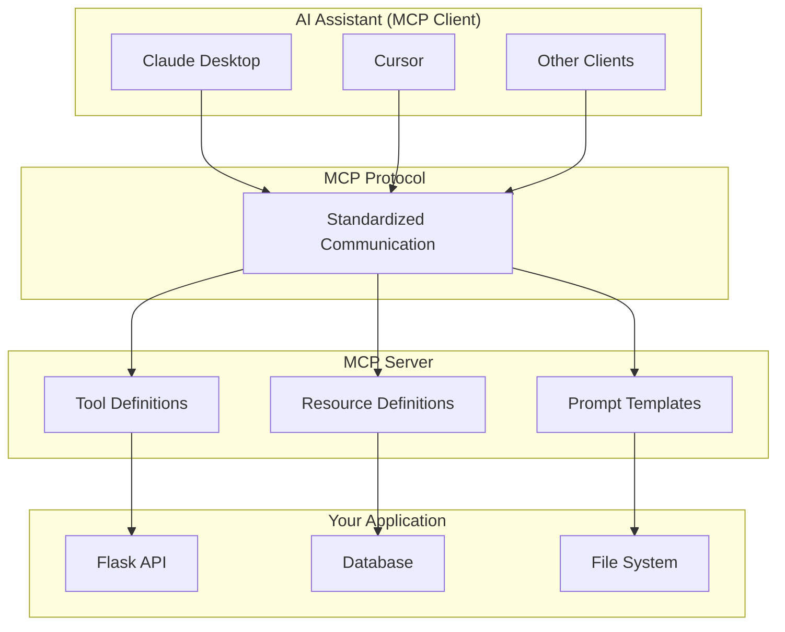
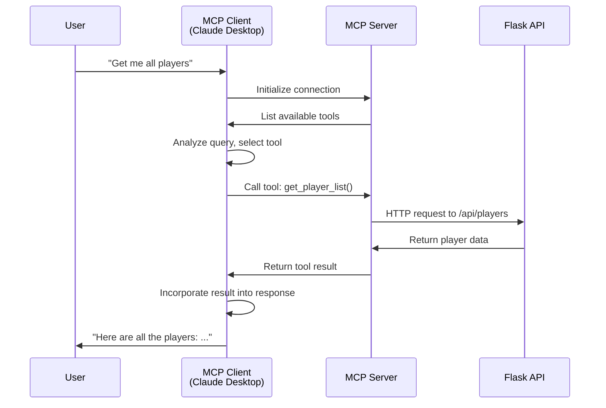
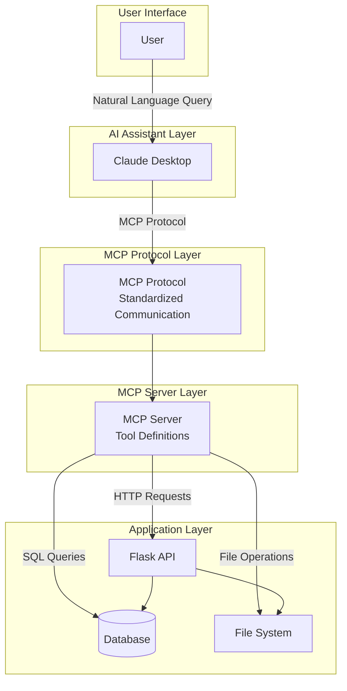
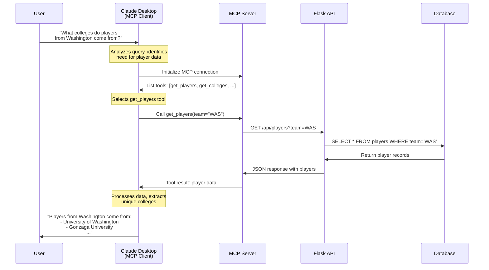

<!---
title: "LLMs, Agents, and MCP"
--->

# LLMs, Agents, and MCP

## Part 1: Large Language Models (LLMs) - Starting from Zero

### What is an LLM?

A **Large Language Model (LLM)** is an artificial intelligence system trained on massive amounts of text data (often trillions of words). These models learn patterns in language and can:

- Generate human-like text
- Answer questions
- Translate languages
- Summarize documents
- Write code
- And much more

Think of an LLM as a very sophisticated autocomplete system that has read a significant portion of the internet and can predict what words should come next based on context.

### Foundation Models

A **foundation model** is a large-scale machine learning model trained on broad data (generally using self-supervision at scale) that can be adapted to a wide range of downstream tasks. The term was coined by researchers at Stanford's Center for Research on Foundation Models.

**Key characteristics of foundation models:**

- **Broad training**: Trained on diverse, large-scale datasets (often internet-scale)
- **General-purpose**: Can be adapted to many different tasks
- **Transfer learning**: Knowledge learned from training can be applied to new tasks
- **Base for specialization**: Can be fine-tuned or used as-is for specific applications

**Foundation Models vs LLMs:**

- **Foundation Model** is the broader category—it includes models for vision, audio, code, etc.
- **LLM (Large Language Model)** is a type of foundation model focused specifically on language
- Examples of foundation models:
  - **Language**: GPT-4, Claude, Llama (these are LLMs)
  - **Vision**: CLIP, DALL-E
  - **Code**: Codex, CodeLlama
  - **Multimodal**: GPT-4V (vision + language), Gemini (multimodal)

When people say "foundation model" in the context of AI assistants, they're often referring to LLMs, but the term encompasses a wider range of models. Most modern LLMs are foundation models—they're trained broadly and can be adapted to many language tasks.

### Key Terminology

- **Foundation Model**: A large-scale model trained on broad data that can be adapted to many tasks. LLMs are a type of foundation model focused on language.
- **LLM (Large Language Model)**: A type of foundation model specifically designed for language tasks (text generation, understanding, etc.).
- **Token**: The basic unit of text that an LLM processes. A token can be a word, part of a word, or a punctuation mark. For example, "Hello world" might be split into 2-3 tokens.
- **Prompt**: The input text you give to an LLM. This is your question, instruction, or context.
- **Completion/Response**: The output text generated by the LLM based on your prompt.
- **Context Window**: The maximum number of tokens an LLM can process in a single conversation. Modern models support 32K-200K+ tokens.
- **Temperature**: A parameter that controls randomness. Lower = more deterministic, Higher = more creative.
- **Fine-tuning**: Training an LLM on specific data to improve performance on particular tasks.
- **Inference**: The process of generating text from an LLM (as opposed to training).

### Example LLM Models

Here are some popular models you should know about:

#### Commercial Models (via APIs)

1. **GPT-4** (OpenAI)
   - One of the most capable models
   - Available via OpenAI API
   - Powers ChatGPT Plus

2. **Claude 3.5 Sonnet** (Anthropic)
   - Strong reasoning and coding capabilities
   - Available via Anthropic API
   - [Anthropic](https://www.anthropic.com)

3. **Gemini Pro** (Google)
   - Google's flagship model
   - Available via Google AI Studio

4. **Llama 3** (Meta)
   - Open-source model
   - Available via various providers
   - Can be run locally or via APIs

#### Open-Source Models (via Hugging Face)

**Hugging Face** is a platform hosting thousands of open-source models:

- [Hugging Face Models](https://huggingface.co/models) - Browse thousands of models
- Popular models include:
  - **Llama 3** (Meta)
  - **Mistral** (Mistral AI)
  - **Phi** (Microsoft)
  - **Gemma** (Google)

You can use these models via:
- Hugging Face Transformers library (Python)
- Hugging Face Inference API
- Local deployment

#### Model Aggregators

**Open Router** provides access to many models through a single API:

- [Open Router](https://openrouter.ai/) - Unified API for 100+ models
- Compare models side-by-side
- Pay-per-use pricing
- Easy to switch between models

### LLM Limitations

While LLMs are powerful, they have important limitations:

1. **Knowledge Cutoff**: They only know information from their training data up to a certain date. They don't know recent events or your private data.
2. **Hallucination**: They can generate plausible-sounding but incorrect information.
3. **No Real-World Actions**: They can't directly interact with external systems (databases, APIs, file systems).
4. **Context Limits**: They have maximum context window sizes.
5. **Static Knowledge**: They can't learn new information after training without fine-tuning or retrieval.

## Part 2: AI Agents - Beyond Simple LLMs

### What is an AI Agent?

An **AI Agent** is an LLM that can use **tools** to interact with the outside world. While a basic LLM can only generate text based on its training data, an agent can:

- Query databases
- Call APIs
- Read files
- Execute code
- Search the web
- Perform actions in real-time

### LLM vs Agent: Key Differences

| Aspect | LLM | Agent |
|--------|-----|-------|
| **Capabilities** | Text generation only | Text generation + tool usage |
| **Knowledge** | Training data only | Training data + real-time data |
| **Actions** | None | Can perform actions via tools |
| **Interactivity** | One-shot responses | Can loop and iterate |
| **Examples** | ChatGPT (basic), Claude (basic) | ChatGPT with plugins, Claude with MCP, LangChain agents |

### The Agent Loop

Agents follow a continuous loop:

```
┌─────────┐
│ Observe │ ← Receive input (user query, tool results, system state)
└────┬────┘
     │
     ▼
┌─────────┐
│  Think  │ ← Process information, decide what to do next
└────┬────┘
     │
     ▼
┌─────────┐
│   Act   │ ← Execute actions (call tools, generate responses)
└────┬────┘
     │
     └──────┐
            │
            ▼
      (Loop continues)
```

1. **Observe**: Receive input (user query, tool results, system state)
2. **Think**: Process information and decide what to do next
3. **Act**: Execute actions (call tools, generate responses)
4. **Observe**: See the results and continue the loop

### Example Agent Systems

Here are some real-world agent systems you can explore:

#### 1. **LangChain Agents**
- Framework for building LLM applications
- Supports multiple LLM providers
- Tool integration and agent orchestration

#### 2. **Claude with MCP** (Model Context Protocol)
- Claude Desktop can connect to MCP servers
- Access custom tools and data sources

#### 3. **ChatGPT with Plugins/Code Interpreter**
- ChatGPT can use plugins for external access
- Code Interpreter can execute Python code

#### 4. **Cursor AI**
- Code editor with built-in AI agent
- Can read your codebase, make changes, run commands

## Part 3: Tools - The Bridge to the Real World

### What is a Tool?

A **tool** is a function that an AI agent can call to interact with external systems. Tools bridge the gap between the LLM's text generation capabilities and real-world actions.

### Tool Structure

Every tool has:

1. **Name**: A unique identifier (e.g., `get_player_list`)
2. **Description**: What the tool does and when to use it
3. **Input Schema**: Parameters the tool accepts (JSON Schema format)
4. **Implementation**: The actual code that executes when called

### Example Tools

Here's an example MCP tool specification (JSON format):

```json
{
    "name": "get_player_list",
    "description": "Retrieves a list of all players from the database. Use this when the user asks about players or wants to see player data.",
    "inputSchema": {
        "type": "object",
        "properties": {
            "limit": {
                "type": "integer",
                "description": "Maximum number of players to return"
            }
        },
        "required": []
    }
}
```

This JSON structure defines an MCP tool with:
- **name**: The tool identifier
- **description**: What the tool does (used by the AI to decide when to call it)
- **inputSchema**: JSON Schema defining the tool's parameters

When you implement an MCP server in Python, you'll use the MCP SDK's `Tool` class, which serializes to this JSON format when communicating over the MCP protocol.

### Common Tool Categories

1. **Database Tools**
   - Query databases
   - Insert/update/delete records
   - Example: `query_players()`, `create_account()`

2. **API Tools**
   - Call REST APIs
   - Interact with web services
   - Example: `get_weather()`, `send_email()`

3. **File System Tools**
   - Read/write files
   - List directories
   - Example: `read_file()`, `write_file()`

4. **Code Execution Tools**
   - Run Python code
   - Execute shell commands
   - Example: `execute_python()`, `run_command()`

5. **Web Tools**
   - Search the web
   - Scrape websites
   - Example: `web_search()`, `fetch_url()`

## Part 4: Model Context Protocol (MCP)

### What is MCP?

The **Model Context Protocol (MCP)** is an open protocol created by Anthropic that enables AI assistants to securely connect to external tools and data sources. It provides a standardized way for AI assistants to discover and use capabilities from external systems.

### Why MCP?

Before MCP, each AI assistant had its own way of connecting to external tools:
- ChatGPT had plugins
- Claude had custom integrations
- Each system was proprietary

MCP provides:
- **Standardization**: One protocol works across multiple AI assistants
- **Security**: Secure, controlled access to tools
- **Discoverability**: AI assistants can discover available tools automatically
- **Composability**: Tools can be combined and chained together

### MCP Architecture



### Key MCP Components

#### 1. **MCP Server**
- Exposes capabilities (tools, resources, prompts) to AI assistants
- Runs as a separate service (often in Docker)
- Communicates via stdio or HTTP

#### 2. **MCP Client**
- AI assistant that connects to servers (Claude Desktop, Cursor, etc.)
- Discovers available tools automatically
- Calls tools when needed

#### 3. **Tools**
- Functions that an AI can call to interact with external systems
- Each tool has a name, description, and input schema
- Tools can perform actions (query databases, call APIs, etc.)

#### 4. **Resources**
- Data sources that an AI can read
- Files, database tables, API endpoints
- Resources provide context without performing actions

#### 5. **Prompts**
- Pre-defined prompt templates
- Reusable prompts for common tasks
- Help standardize interactions

### How MCP Works - Detailed Flow



### Why not a REST API?

MCP uses **Server-Sent Events (SSE)** for real-time communication:

- **REST**: One request → wait → one response → connection closes
- **MCP/SSE**: Long-lived connection → multiple messages → streaming updates

This enables:
- Real-time feedback during tool execution
- Streaming responses for long operations
- Continuous communication between client and server

## Part 5: Claude Skills and Other Tool Systems

### What are Claude Skills?

**Claude Skills** (also called "Actions" or "Tool Use") is Claude's built-in capability to use tools. When you give Claude access to tools, it can:

- Automatically decide when to use tools
- Call multiple tools in sequence
- Combine tool results into coherent responses

Claude Skills work with:
- MCP servers (via Claude Desktop)
- Custom API integrations
- Function calling (via Anthropic API)

## Part 6: How Everything Works Together

### Complete System Architecture



### Example: Complete Interaction Flow

**Scenario**: User asks "What colleges do players from Washington come from?"


